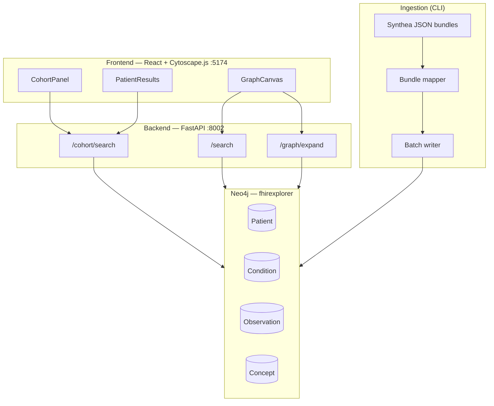

# EHR Data Explorer — Architecture

A short overview of **what we are building** and **how it works**.

---

## What We Are Building

**EHR Data Explorer** is a web app for exploring synthetic patient health data stored as a **graph** in Neo4j.

It lets users:

1. **Search cohorts** — find patients by condition, location, gender, or natural language (e.g. *"female patients with diabetes in Massachusetts"*)
2. **View results** — see patient lists or aggregation counts (e.g. *"count patients by gender"*)
3. **Visualize relationships** — click into an interactive graph to explore how patients connect to conditions, observations, and medical concepts

Data comes from **Synthea FHIR R4 bundles** (synthetic EHR records), loaded into a dedicated Neo4j database called `fhirexplorer`.

---

## High-Level Architecture



---

## How It Works (3 Layers)

### 1. Data ingestion (one-time / batch)

```
Synthea FHIR JSON  →  parse  →  map to graph nodes  →  write to Neo4j
```

| Step | What happens |
|------|--------------|
| `init-db` | Creates Neo4j database `fhirexplorer` |
| `init-schema` | Adds constraints and indexes |
| `load` | Reads patient bundle files, creates nodes and relationships |

**Graph model stored in Neo4j:**

```
Patient -[:HAS_CONDITION]-> Condition -[:CODED_AS]-> Concept
Patient -[:HAS_OBSERVATION]-> Observation -[:CODED_AS]-> Concept
Patient -[:HAS_ENCOUNTER]-> Encounter
```

### 2. Backend API (FastAPI)

The API runs Cypher queries against Neo4j and returns JSON.

| Route | Purpose |
|-------|---------|
| `POST /cohort/search` | Find or count patients (structured filters or natural language) |
| `GET /cohort/filters` | Dropdown options (states, genders, conditions) |
| `POST /search` | Search medical `Concept` nodes |
| `POST /graph/expand` | Expand one graph layer on click (concept → patients → clinical data) |
| `GET /health` | API + Neo4j connectivity check |

**Cohort search flow:**

```
User query  →  parse intent (condition, state, gender, aggregation?)
            →  resolve Concept (e.g. "diabetes" → SNOMED code)
            →  Cypher: match Patient → Condition → Concept
            →  return patient list or aggregation counts
```

### 3. Frontend (React)

Two main views in one app:

| View | Component | User action |
|------|-----------|-------------|
| **Cohort** | `CohortPanel` + `PatientResults` | Search / filter patients, paginate results |
| **Graph** | `GraphCanvas` (Cytoscape.js) | Click nodes to expand relationships visually |

Switching from cohort results → graph: user clicks **"Visualize in graph"**, which loads the matched concept as the root node and expands from there.

---

## Project Structure

```
ehr_data_explorer/
├── ingestion/          # Synthea → Neo4j pipeline (CLI)
├── app/                # FastAPI backend
│   ├── routers/        # /cohort, /search, /graph
│   ├── services/       # Cypher logic, NLP parsing
│   └── db/neo4j.py     # Neo4j connection
├── frontend/           # React UI
│   └── src/components/ # CohortPanel, GraphCanvas, PatientResults
└── scripts/            # verify_ingestion.py
```

---

## Data Flow Example

**User asks:** *"female patients with diabetes in Massachusetts"*

```
1. Frontend sends POST /cohort/search { query: "..." }
2. Backend parses → condition=diabetes, gender=female, state=Massachusetts
3. Backend resolves "diabetes" → Concept (SNOMED code)
4. Cypher finds matching Patients
5. Frontend shows patient table (6 results)
6. User clicks "Visualize in graph"
7. Graph loads Concept node → click to expand → PatientGroup → Gender → Region → Patient → Conditions/Observations
```

---

## Tech Stack

| Layer | Technology |
|-------|------------|
| Database | Neo4j (`fhirexplorer`) |
| Backend | Python, FastAPI, neo4j driver |
| Ingestion | Typer CLI, Synthea FHIR R4 |
| Frontend | React, Vite, Cytoscape.js |
| Data | Synthea synthetic patient bundles |

---

## Related Docs

- [README.md](./README.md) — setup and run instructions
- [frontend/README.md](./frontend/README.md) — UI details (if present)
